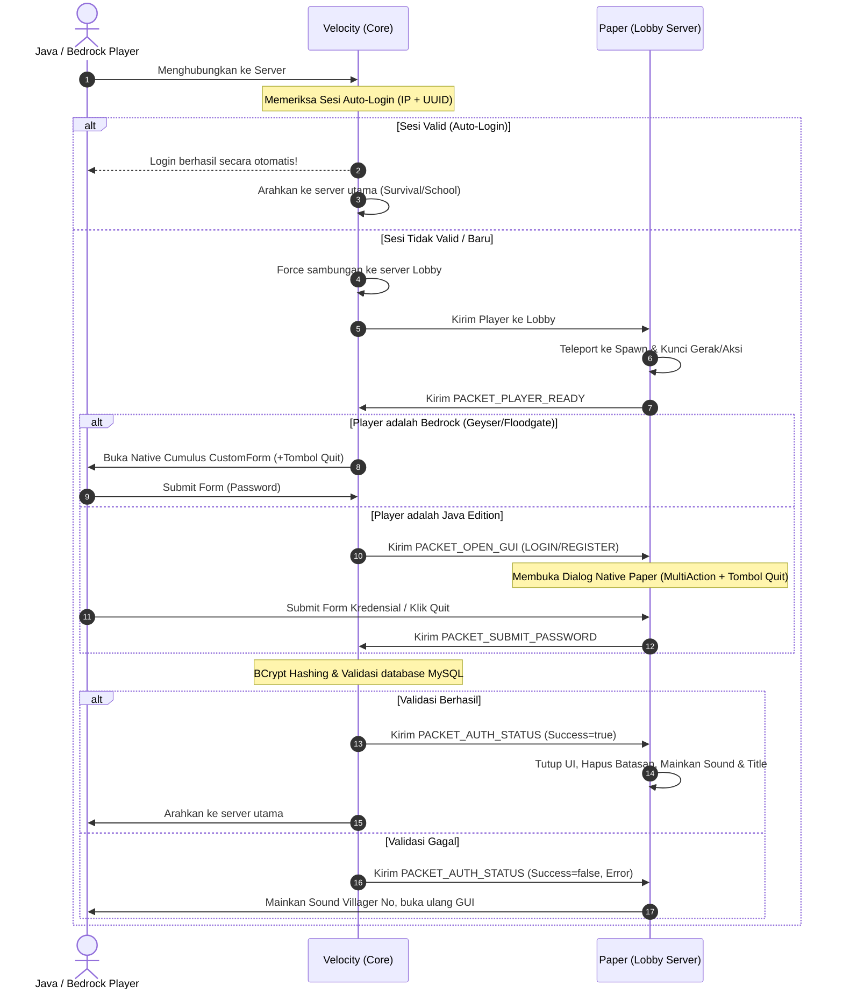

# NaturalAuth 🔐

[](https://github.com/Natural-Minecraft/NaturalCore/actions)


**NaturalAuth** adalah sistem autentikasi in-game cross-platform (Java & Bedrock) modern, aman, dan berestetika premium yang dirancang khusus untuk server Minecraft **NaturalSMP**. Menggunakan arsitektur terpisah (split architecture) yang mengintegrasikan proxy **Velocity** sebagai inti keamanan terpusat dan server backend **Paper** sebagai pelaksana interaksi visual.

---

## 🏗️ Desain Arsitektur (Velocity + Paper)

Plugin ini **memerlukan kedua modul** untuk dapat berjalan secara fungsional penuh:



### Mengapa Arsitektur Ini Dipilih?
1. **Keamanan Terpusat di Velocity**: Semua query database, hashing sandi dengan **BCrypt**, dan manajemen sesi *remember-me* diproses di level proxy. Ini mencegah pemain yang tidak terotentikasi mengirimkan paket berbahaya ke server backend.
2. **Dual-Platform GUI**: 
   * **Bedrock (Geyser)**: Menggunakan form native Minecraft Bedrock (`Cumulus API`) sehingga tampilan login/register berupa dialog isian teks resmi yang rapi.
   * **Java Edition**: Menggunakan **Paper Dialog API** (`io.papermc.paper.dialog`) yang sangat modern dengan fallback otomatis ke **WesJD AnvilGUI** jika API Dialog tidak tersedia di server Paper backend.

---

## ✨ Fitur Utama & Premium UX

*   **Gatekeeping Proxy**: Memblokir chat, command, pergerakan, penghancuran/penempatan blok, interaksi inventory, item drop/pickup, dan pembatalan damage sebelum login sukses.
*   **Auto-Login (Remember-Me)**: Sesi token aktif berbasis kombinasi IP + UUID selama rentang waktu yang dapat diatur (default: 24 jam).
*   **BossBar Real-Time Countdown (Paper)**: Bar indikator waktu berwarna gradasi dinamis (Hijau $\rightarrow$ Kuning saat $\le 20$s $\rightarrow$ Merah saat $\le 10$s) untuk memandu pemain menyelesaikan login sebelum batas 60 detik.
*   **ActionBar Interaktif (Paper)**: Menampilkan petunjuk jalan keluar bergantian secara berkala ("Gunakan GUI" / "/register") untuk mempermudah pemain baru.
*   **Title & Sound Effects (Paper)**: Efek visual `✔ Login Berhasil!` dengan suara `ENTITY_PLAYER_LEVELUP` saat sukses, serta getaran suara `ENTITY_VILLAGER_NO` saat kata sandi salah.
*   **Proteksi Brute Force (Velocity)**: Batas maksimal `5 kali` percobaan gagal, setelah itu pemain akan dikunci (`cooldown`) selama `60 detik` dengan tampilan kick screen bertema merah tegas.
*   **Validasi Keamanan Sandi (Velocity)**: Validasi registrasi mewajibkan sandi minimal `6 karakter`, dilarang sama dengan username, dan memblokir kata sandi pasaran (`123456`, `password`, `minecraft`, dll).
*   **URL Pemulihan Sandi Pintar (`/forgotpassword`)**: URL otomatis menyematkan query parameter nama pemain (`?username=<name>`) dengan encoding UTF-8 agar memudahkan proses pemulihan di website.
*   **Danger Zone Confirmation (`/unregister`)**: Tampilan peringatan bahaya berdesain kotak merah in-game untuk mencegah penghapusan akun yang tidak disengaja.
*   **Multi-Action Dialog & Quit Button**: Java Edition Dialogs memiliki tombol **Quit / Keluar** di bagian bawah (menggunakan `DialogType.multiAction`), begitu pula Bedrock Form yang menyertakan toggle "Keluar dari Server". Pemain tidak akan pernah terjebak di layar hitam atau terkunci tanpa opsi keluar.
*   **Lobby Mode Selection (`lobby-mode` in Paper)**: Companion Paper plugin dapat diatur `lobby-mode: false` (misalnya pada server **School** atau **Survival**). Jika dimatikan, plugin akan langsung menganggap semua pemain terautentikasi (menghilangkan teleportasi & lock) namun tetap mengaktifkan listener GUI/Whois dinamis.

---

## 🎮 Referensi Perintah (Commands)

### Perintah Pemain (Player Commands)
| Perintah | Alias | Deskripsi |
| :--- | :--- | :--- |
| `/login <password>` | - | Masuk ke akun Anda (no-args memicu GUI). |
| `/register <pass> <confirm>` | - | Mendaftar akun baru (no-args memicu GUI). |
| `/unregister confirm` | - | Menghapus akun secara permanen dari database server. |
| `/email <email>` | - | Mengaitkan email untuk reset sandi mandiri via web (memicu Anvil OTP GUI). |
| `/forgotpassword` | `/lupasandi`, `/resetpassword`, `/changepassword` | Mendapatkan link pemulihan akun berparameter otomatis ke website. |
| `/logout` | - | Keluar dari sesi login aktif dan keluar dari server. |
| `/premium` | - | Mengaktifkan mode Premium Mojang (auto-login tanpa sandi in-game). |
| `/cracked` | - | Menonaktifkan mode Premium (kembali menggunakan kata sandi). |

### Perintah Admin (Admin Commands)
*(Memerlukan permission `naturalauth.admin`, mendukung tab-completion lengkap)*

| Perintah | Deskripsi |
| :--- | :--- |
| `/na admin forcelogin <player>` | Memaksa masuk pemain online yang belum login. |
| `/na admin forceregister <player> <pass> <pass>` | Mendaftarkan pemain baru secara manual. |
| `/na admin changepassword <player> <newPass>` | Mengubah kata sandi akun pemain lain. |
| `/na admin changeemail <player> <newEmail>` | Mengubah email terdaftar pemain lain. |
| `/na admin unregister <player>` | Menghapus pendaftaran akun pemain lain. |
| `/na admin kick <player/all/*>` | Menendang pemain dari jaringan server. |
| `/na admin getotp <email>` | Melihat kode OTP aktif untuk alamat email tertentu. |
| `/na admin resendotp <email>` | Mengirimkan ulang kode OTP aktif ke email terkait. |
| `/na admin whois <player>` | Membuka Chest GUI khusus (Read-Only) berisi data lengkap pemain (IP, lokasi, status, dll). |
| `/na admin setpremium <player>` | Mengubah status akun pemain menjadi Premium (menghapus hash sandi). |
| `/na admin setcracked <player>` | Mengubah status akun menjadi Cracked (menghapus pendaftaran agar daftar ulang). |

---

## 📂 Struktur Modul Project

Project didefinisikan sebagai multi-module Maven:
1.  **`naturalauth-parent`** (`/pom.xml`): Parent POM yang mengorkestrasi dependencies dan proses kompilasi.
2.  **`naturalauth-common`**: Berisi definisi paket data dan protokol jembatan pesan plugin (`naturalauth:bridge`).
3.  **`naturalauth-velocity`**: Core plugin yang berjalan di Velocity Proxy.
4.  **`naturalauth-paper`**: Companion plugin yang berjalan di server Paper backend.

---

## 🚀 Instalasi & Konfigurasi

### Sisi Proxy (Velocity)
1. Salin file `.jar` hasil kompilasi modul `naturalauth-velocity` ke folder `plugins` proxy Anda.
2. Restart proxy untuk menghasilkan file `plugins/naturalauth/config.toml`.
3. Atur database MySQL/MariaDB serta success-target server:
   ```toml
   [database]
   host = "localhost"
   port = 3306
   name = "nsmp_naturalauth"
   username = "root"
   password = "sandi_mysql_kamu"
   table-prefix = "naturalauth_"

   [servers]
   lobby = "lobby"            # Nama server lobby/auth di velocity.toml
   success-target = "school"  # Server tujuan setelah login sukses (misal: school)
   ```

### Sisi Backend Server (Paper - Lobby & School)
1. Salin file `.jar` hasil kompilasi modul `naturalauth-paper` ke folder `plugins` server Paper Anda.
2. Jalankan/restart server untuk menghasilkan folder `plugins/NaturalAuthPaper/config.yml`.
3. Atur peran server:
   * **Pada Server Lobby:**
     Pastikan `lobby-mode` bernilai `true` agar memicu interaksi login penuh.
     ```yaml
     lobby-mode: true
     enable-schematic-loading: true
     ```
   * **Pada Server School / Survival:**
     Ubah `lobby-mode` menjadi `false` agar pemain tidak terjebak teleportasi lobby dan langsung dapat bermain, namun tetap dapat mengeksekusi perintah admin/pemain secara global!
     ```yaml
     lobby-mode: false
     enable-schematic-loading: false
     ```

---

## 🛠️ Cara Build (Kompilasi)

### Manual (Local Environment)
Jalankan perintah berikut di root folder project:
```bash
mvn clean package
```
*   Velocity JAR: `naturalauth-velocity/target/naturalauth-velocity-1.0-SNAPSHOT.jar`
*   Paper JAR: `naturalauth-paper/target/naturalauth-paper-1.0-SNAPSHOT.jar`

*Catatan: Sesuai aturan pengembangan, hindari melakukan build lokal jika Anda berencana mengunggahnya langsung ke CI/CD GitHub Actions.*

### Otomatis (CI/CD GitHub Actions)
Setiap kali ada `git push` ke branch `main`, workflow di `.github/workflows/build.yml` akan secara otomatis melakukan kompilasi penuh menggunakan JDK 21, menjalankan unit test, dan mengunggah artifact kompilasi `.jar` secara instan dan siap pakai ke halaman run GitHub Actions Anda!
