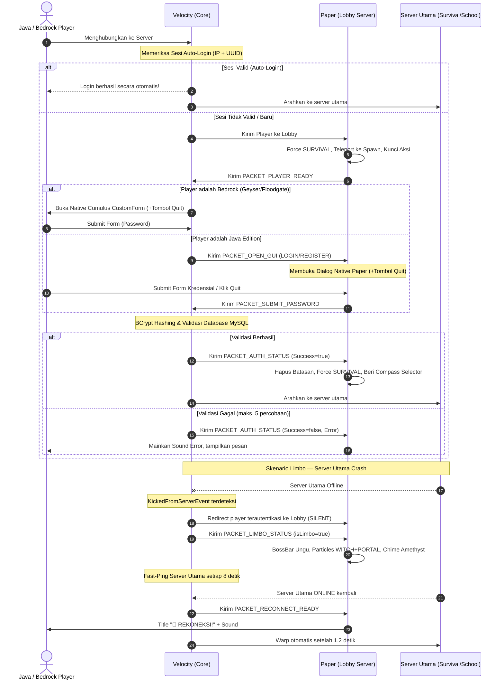

# NaturalAuth 🔐

[](https://github.com/Natural-Minecraft/NaturalAuth/actions)


**NaturalAuth** adalah sistem autentikasi in-game cross-platform (Java & Bedrock) modern, aman, dan berestetika premium yang dirancang khusus untuk server Minecraft **NaturalSMP**. Plugin ini menggunakan arsitektur terpisah *(split architecture)* yang mengintegrasikan proxy **Velocity** sebagai inti keamanan terpusat dan server backend **Paper** sebagai pelaksana interaksi visual.

Keunggulan utama plugin ini adalah konsep **Limbo Waiting Room** — sistem ruang tunggu cerdas yang menangkap pemain ketika server utama crash atau restart, lalu menampung mereka di Lobby dengan aura estetika penuh (particle effects, BossBar dinamis, melodi amethyst) sampai server kembali online dan mereka otomatis dikirim kembali.

---

## 🏗️ Desain Arsitektur (Velocity + Paper)

Plugin ini **memerlukan kedua modul** untuk dapat berjalan secara fungsional penuh:



### Mengapa Arsitektur Ini Dipilih?
1. **Keamanan Terpusat di Velocity**: Semua query database, hashing BCrypt, dan manajemen sesi diproses di level proxy. Ini mencegah serangan dari server backend yang dikompromikan.
2. **Dual-Platform GUI**: Bedrock menggunakan **Cumulus Native Form** sedangkan Java menggunakan **Paper Dialog API** modern, dengan fallback ke **AnvilGUI** secara otomatis.
3. **Limbo Architecture**: Satu-satunya implementasi yang menggunakan `KickedFromServerEvent` Velocity untuk *silent redirect* ke Lobby sebagai ruang tunggu (bukan disconnect) sehingga pemain tidak kehilangan koneksi proxy saat server backend mati.

---

## ✨ Fitur Lengkap & Premium UX

### 🔐 Autentikasi & Keamanan
| Fitur | Detail |
|:------|:-------|
| **Auto-Login (Remember Me)** | Sesi token aktif berbasis IP + UUID, dapat diatur ke 24 jam atau sesuai kebutuhan. |
| **Premium Auto-Bypass** | Pemain dengan akun Mojang asli (Online Mode) langsung terotentikasi tanpa input sandi. |
| **Bedrock Auto-Bypass** | Pemain Geyser/Floodgate langsung melewati proses password login. |
| **BCrypt Password Hashing** | Semua sandi di-hash menggunakan BCrypt dengan round cost yang dapat dikonfigurasi. |
| **Proteksi Brute Force** | Maksimal **5 percobaan** login salah. Setelah itu pemain dikick dengan cooldown **60 detik**. |
| **Validasi Kekuatan Sandi** | Wajib minimal 6 karakter, tidak boleh sama dengan username, blokir 18+ password pasaran (123456, minecraft, dll). |
| **Pemblokiran Penuh** | Chat, command, gerakan, block break/place, damage, item drop/pickup, interaksi inventory — semua diblokir sebelum login. |
| **OTP Email Verification** | Setelah registrasi, pemain dapat mengaitkan email dan memverifikasi via kode OTP 6 digit yang dikirim ke inbox mereka. |

### 🎨 Visual & UX (Paper Lobby)
| Fitur | Detail |
|:------|:-------|
| **Logo Resource Pack Unicode** | Karakter unicode dari font kustom ItemsAdder (mis. logo NaturalSMP) ditampilkan di atas form Login & Register melalui `LogoRPUnicode` di config. Mendukung PlaceholderAPI untuk placeholder dinamis. |
| **BossBar Countdown** | Bar real-time berwarna gradasi (Hijau → Kuning saat ≤20s → Merah saat ≤10s) menunjukkan waktu login tersisa. |
| **ActionBar Hints** | Petunjuk bergantian periodik: cara membuka GUI, cara daftar via `/register`. |
| **Title + Sound Success** | `✔ Login Berhasil!` dengan suara `ENTITY_PLAYER_LEVELUP` saat berhasil login. |
| **Error Sound** | Suara `ENTITY_VILLAGER_NO` saat password salah. |
| **Quit Button** | Tombol Keluar tersedia di semua form login/register (Java Dialog & Bedrock Form) agar pemain tidak pernah terjebak. |
| **Kick Screen Bertema** | Pesan kick saat timeout, brute force, atau aksi admin menggunakan format multi-line berdesain rapi. |

### 🌌 Limbo Waiting Room *(Fitur Eksklusif & Pelopor)*
Konsep ini **belum pernah ada** di plugin autentikasi Minecraft lainnya. Ketika server utama crash atau restart:

| Aspek | Detail |
|:------|:-------|
| **Silent Redirect** | Pemain **tidak di-disconnect** dari proxy. `KickedFromServerEvent` dicegah, lalu diarahkan senyap ke Lobby. |
| **Limbo BossBar Ungu** | Bar bertema `🌌 LIMBO 🌌` berwarna ungu berkedip animasi bergantian antara dua teks. |
| **Particle Atmosphere** | Partikel `SPELL_WITCH` dan `PORTAL` dipancarkan di sekeliling pemain setiap 0.25 detik secara halus. |
| **Amethyst Chime** | Melodi `BLOCK_AMETHYST_BLOCK_CHIME` berbunyi acak setiap 4 detik menciptakan suasana mistis. |
| **ActionBar Rotating Hints** | 3 petunjuk berbeda dirotasikan setiap 5 detik: status limbo, cara pakai kompas, status monitoring. |
| **Chat Announcement** | Pesan chat bergaya kotak ASCII `━━━━━` ditampilkan menjelaskan situasi Limbo saat pertama masuk. |
| **Auto-Reconnect** | Proxy melakukan fast-ping ke server utama setiap **8 detik** (percepatan dinamis dari 5 menit normal). Saat server online, pemain mendapatkan Title `🚀 REKONEKSI!` + dua suara dramatis, lalu warp otomatis setelah **1.2 detik** — cukup waktu untuk efek visual berjalan. |
| **Force SURVIVAL** | Saat masuk Limbo, gamemode dipaksa ke SURVIVAL sehingga pemain bisa berjalan-jalan di peta lobby. |

### 🧭 Server Selector Compass
Item premium yang diberikan ke semua pemain terautentikasi di Lobby:

| Aspek | Detail |
|:------|:-------|
| **Item** | `COMPASS` bernama `§b§lServer Selector §7(Right-Click)` dengan lore kustom. Diletakkan di **hotbar slot ke-5** (tengah). |
| **Proteksi** | Kompas **tidak bisa dijatuhkan** (`PlayerDropItemEvent`) dan **tidak bisa dipindahkan** via klik inventory. |
| **Chest GUI** | Klik kanan kompas membuka GUI `§8⚡ Server Selector ⚡` (27 slot) dengan efek suara Ender Chest Open. |
| **Slot 11 — School** | Ikon `BOOKSHELF` bernama `§a§l🏫 School Server`. Klik → warp ke server `school`. |
| **Slot 13 — Survival** | Ikon `GRASS_BLOCK` bernama `§e§l🌲 Survival Server`. Klik → warp ke server `survival`. |
| **Slot 15 — Lobby** | Ikon `NETHER_STAR` bernama `§d§l🌌 Lobby`. Klik → notif sudah di Lobby (no-op). |
| **Transfer Native** | Warp menggunakan protokol standar `BungeeCord` channel — `Connect <serverName>`. Tidak memerlukan plugin tambahan. |
| **Suara Konfirmasi** | Suara `ENTITY_ENDERMAN_TELEPORT` saat klik School/Survival untuk feedback audio instan. |

---

## 🎮 Referensi Perintah (Commands)

### Perintah Pemain — Tersedia di Semua Server
> Semua perintah ini diregistrasi di level **Velocity** sehingga dapat digunakan dari mana saja di jaringan server (Lobby, School, Survival, dll).

| Perintah | Alias | Deskripsi |
|:---------|:------|:----------|
| `/login <password>` | — | Masuk ke akun (no-args membuka GUI login). |
| `/register <pass> <confirm>` | — | Mendaftarkan akun baru (no-args membuka GUI register). |
| `/unregister confirm` | — | Menghapus akun secara permanen dengan layar konfirmasi. |
| `/email <email>` | — | Mengaitkan email untuk pemulihan akun (memicu OTP). |
| `/forgotpassword` | `/lupasandi`, `/resetpassword`, `/changepassword` | Mendapatkan link pemulihan berparameter otomatis ke website. |
| `/logout` | — | Keluar dari sesi dan kembali ke layar login. |
| `/premium` | — | Aktifkan mode Premium Mojang (auto-login tanpa password). |
| `/cracked` | — | Nonaktifkan mode Premium, kembali menggunakan password. |

### Perintah Admin — Dapat Dijalankan dari Console & Semua Server
> Semua sub-command admin memerlukan permission `naturalauth.admin`. Semua dapat dijalankan dari **Terminal Console** maupun **in-game dari server manapun** di jaringan.

| Perintah | Deskripsi | Dapat di Console? |
|:---------|:----------|:-----------------:|
| `/na admin forcelogin <player>` | Memaksa login pemain online. | ✅ |
| `/na admin forceregister <player> <pass> <pass>` | Mendaftarkan pemain secara manual. | ✅ |
| `/na admin changepassword <player> <newPass>` | Mengubah kata sandi akun pemain. | ✅ |
| `/na admin changeemail <player> <newEmail>` | Mengubah email terdaftar pemain. | ✅ |
| `/na admin unregister <player>` | Menghapus registrasi akun pemain. | ✅ |
| `/na admin kick <player/all/*>` | Menendang pemain atau semua pemain. | ✅ |
| `/na admin getotp <email>` | Melihat kode OTP aktif untuk email. | ✅ |
| `/na admin resendotp <email>` | Mengirim ulang OTP ke email. | ✅ |
| `/na admin whois <player>` | **In-game:** Chest GUI profil lengkap. **Console:** Output log terminal berformat rapi (Status, Server, IP, UUID, Ping, Premium, Email, Tanggal Daftar). | ✅ |
| `/na admin setpremium <player>` | Mengubah status akun menjadi Premium. | ✅ |
| `/na admin setcracked <player>` | Mengubah status akun menjadi Cracked (hapus registrasi). | ✅ |
| `/na admin reload` | **Deep reload** `config.toml` dari disk — menerapkan ulang semua settings (session-expiry, auto-login, bcrypt-rounds, website-url, server names) **tanpa restart server** dan tanpa memutus koneksi database atau mengeluarkan pemain yang sedang online. | ✅ |

**Contoh output `/na admin whois` di Console:**
```
=========================================
⚡ NaturalAuth Console Whois: PlayerName ⚡
=========================================
• Status:         ONLINE
• Server:         survival
• IP Address:     192.168.1.100
• Ping:           24 ms
• UUID:           xxxxxxxx-xxxx-xxxx-xxxx-xxxxxxxxxxxx
• Premium Account: Yes
• Email Terkait:  player@email.com
• No. Telepon:    N/A
• Tanggal Daftar: 2026-05-20 10:32:00
=========================================
```

---

## 📦 Protokol Paket Plugin (naturalauth:bridge)

Komunikasi antara Velocity dan Paper menggunakan channel kustom `naturalauth:bridge`:

| Packet ID | Arah | Nama | Payload | Deskripsi |
|:----------|:-----|:-----|:--------|:----------|
| `1` | Velocity → Paper | `PACKET_OPEN_GUI` | UUID, type, prompt | Membuka Dialog/AnvilGUI login atau register. |
| `2` | Paper → Velocity | `PACKET_SUBMIT_PASSWORD` | UUID, password | Pemain mengirimkan password dari GUI. |
| `3` | Velocity → Paper | `PACKET_AUTH_STATUS` | UUID, success, message | Hasil validasi login (sukses/gagal + pesan). |
| `4` | Paper → Velocity | `PACKET_PLAYER_READY` | UUID | Paper menyatakan pemain siap menerima GUI. |
| `5` | Velocity → Paper | `PACKET_OPEN_RULES` | UUID | Membuka dialog peraturan server. |
| `6` | Paper → Velocity | `PACKET_RULES_ACCEPTED` | UUID | Pemain menyetujui peraturan. |
| `7` | Paper → Velocity | `PACKET_RULES_DECLINED` | UUID | Pemain menolak peraturan (auto-kick). |
| `8` | Paper → Velocity | `PACKET_SUBMIT_EMAIL` | UUID, email | Pemain mengirimkan email untuk OTP. |
| `9` | Velocity → Paper | `PACKET_OPEN_EMAIL_LINK` | UUID | Membuka GUI pengaitan email. |
| `10` | Velocity → Paper | `PACKET_OPEN_OTP_GUI` | UUID, prompt | Membuka GUI input kode OTP. |
| `11` | Paper → Velocity | `PACKET_SUBMIT_OTP` | UUID, otpCode | Pemain mengirimkan kode OTP. |
| `12` | Velocity → Paper | `PACKET_WHOIS_REQUEST` | UUID (admin), targetUsername | Memicu GUI Whois untuk admin. |
| `13` | Velocity → Paper | `PACKET_LIMBO_STATUS` | UUID, isLimbo (boolean) | Mengaktifkan atau menonaktifkan mode Limbo di Paper. |
| `14` | Velocity → Paper | `PACKET_RECONNECT_READY` | UUID | Server utama online, trigger Title reconnect. |

---

## 📂 Struktur Modul Project

```
NaturalAuth/
├── naturalauth-common/          # Konstanta protokol (AuthBridgeProtocol.java)
├── naturalauth-velocity/        # Core plugin Velocity
│   ├── command/                 # Login, Register, Logout, Email, ForgotPassword,
│   │                            #   Unregister, Premium, Cracked, NaturalAuthAdmin
│   ├── database/                # DatabaseManager (MySQL/MariaDB)
│   ├── listener/                # VelocityListener (semua event proxy)
│   └── session/                 # SessionManager (auto-login token)
├── naturalauth-paper/           # Companion plugin Paper (Lobby)
│   ├── gui/                     # AnvilGuiRenderer, DialogRenderer
│   ├── listener/                # PaperListener (event server + plugin messages)
│   └── schematic/               # SchematicLoader (peta Lobby .nbt)
└── pom.xml                      # Parent Maven POM
```

---

## 🚀 Instalasi & Konfigurasi

### Sisi Proxy (Velocity)
1. Salin `naturalauth-velocity-1.0-SNAPSHOT.jar` ke folder `plugins/` di Velocity proxy.
2. Restart proxy → akan membuat `plugins/naturalauth/config.toml`.
3. Edit konfigurasi:

```toml
[database]
host     = "localhost"
port     = 3306
name     = "nsmp_naturalauth"
username = "root"
password = "sandi_mysql_kamu"
table-prefix = "naturalauth_"

[settings]
auto-login           = true
session-expiry-hours = 24
bcrypt-rounds        = 10
auto-detect-premium  = true
bypass-bedrock-passwords = true
website-url          = "https://naturalsmp.net"

[servers]
lobby          = "lobby"     # Nama server Lobby di velocity.toml
success-target = "survival"  # Server tujuan setelah login berhasil

[rules]
enabled = false
# Aktifkan untuk menampilkan peraturan server sebelum masuk server utama
```

### Sisi Backend Server (Paper)

**Server Lobby** (tempat login berlangsung):
```yaml
# plugins/NaturalAuthPaper/config.yml
lobby-mode: true
enable-schematic-loading: true

# Logo Resource Pack Unicode (opsional)
# Isi dengan karakter unicode dari font ItemsAdder kamu (mis. logo NaturalSMP).
# Karakter ini akan ditampilkan di atas form Login & Register.
# Mendukung PlaceholderAPI placeholder dan kode warna &.
# Kosongkan ("") untuk menonaktifkan fitur logo.
LogoRPUnicode: ""

spawn-location:
  world: world
  x: 0.5
  y: 102.0
  z: 0.5
  yaw: 0.0
  pitch: 0.0
```

**Server School / Survival** (server permainan):
```yaml
# Ubah lobby-mode menjadi false agar pemain tidak diblokir
lobby-mode: false
enable-schematic-loading: false
```
> **Catatan:** Dengan `lobby-mode: false`, plugin Paper akan langsung menganggap semua pemain terautentikasi. Ini memungkinkan server sekolah/survival berjalan normal tanpa proses login ulang, namun event listener GUI dan admin tetap aktif.

> **Catatan ItemsAdder & PlaceholderAPI:** `LogoRPUnicode` hanya tampil jika resource pack server sudah aktif di client. Pastikan `PlaceholderAPI` terinstall di server Lobby jika menggunakan placeholder di dalam nilai `LogoRPUnicode`. PlaceholderAPI adalah **soft-dependency** — plugin tetap berjalan normal tanpa PAPI.

---

## 🛠️ Cara Build (Kompilasi)

### Otomatis — CI/CD GitHub Actions *(Direkomendasikan)*
Setiap `git push` ke branch `main` akan memicu workflow `.github/workflows/build.yml` secara otomatis:
- Kompilasi penuh menggunakan **JDK 21**
- Upload artifact `.jar` (Velocity + Paper) ke halaman run GitHub Actions

### Manual (Lokal)
```bash
mvn clean package
```
- Velocity JAR: `naturalauth-velocity/target/naturalauth-velocity-1.0-SNAPSHOT.jar`
- Paper JAR: `naturalauth-paper/target/naturalauth-paper-1.0-SNAPSHOT.jar`

---

## 🧪 Panduan Pengujian Fungsional

### 1. Verifikasi Login Normal
```
1. Join server sebagai pemain baru → BossBar countdown muncul
2. GUI Dialog (atau AnvilGUI) login/register terbuka
3. Input password → cek Title "✔ Login Berhasil!" + sound
4. Verifikasi redirect ke server survival/school
```

### 2. Verifikasi Proteksi Brute Force
```
1. Login dengan password salah 5x berturut-turut
2. Pastikan kick screen muncul dengan pesan "🚫 Terlalu Banyak Percobaan!"
3. Join kembali dalam 60 detik → pastikan masih terkunci dengan countdown timer
```

### 3. Verifikasi Limbo + Server Selector
```
1. Login ke server → masuk Lobby
2. Pastikan gamemode = SURVIVAL dan kompas ada di hotbar slot 5
3. Klik kanan kompas → GUI Server Selector terbuka (⚡ Server Selector ⚡)
4. Klik "School Server" → pastikan warp ke server school
5. Klik "Survival Server" → pastikan warp ke server survival
```

### 4. Verifikasi Limbo Waiting Room
```
1. Pastikan ada pemain online di Lobby (sudah login)
2. Matikan server Survival dari terminal
3. Pantau: pemain TIDAK disconnect, melainkan diarahkan ke Lobby secara senyap
4. Verifikasi: BossBar ungu muncul, partikel, chime amethyst terdengar
5. Nyalakan kembali server Survival
6. Pantau: Title "🚀 REKONEKSI!" muncul, lalu warp otomatis dalam ~1.2 detik
```

### 5. Verifikasi Admin Console Commands
```
# Di terminal console Velocity:
/na admin whois <playerName>
# → Pastikan output log rapi dengan semua info profil

/na admin forcelogin <playerName>
# → Pastikan pemain yang belum login langsung terautentikasi

/na admin kick all
# → Pastikan semua pemain ter-disconnect
```

---

## 🔒 Catatan Keamanan

- **Password**: Di-hash menggunakan BCrypt (NIST-recommended), tidak pernah disimpan plaintext.
- **Sesi**: Token sesi menggunakan kombinasi UUID + IP. Perubahan IP akan memicu login ulang.
- **SQL Injection**: Semua query menggunakan `PreparedStatement`.
- **Proxy-Side Validation**: Semua validasi kritis (password, OTP, sesi) diproses di Velocity — tidak ada celah bypass melalui server backend.
- **Limbo Redirect**: Menggunakan `KickedFromServerEvent.RedirectPlayer` bukan disconnect, sehingga sesi proxy tetap aktif dan aman.

---

## 📄 Lisensi

Proprietary — NaturalSMP Internal Plugin. Dilarang mendistribusikan atau memodifikasi tanpa izin.
