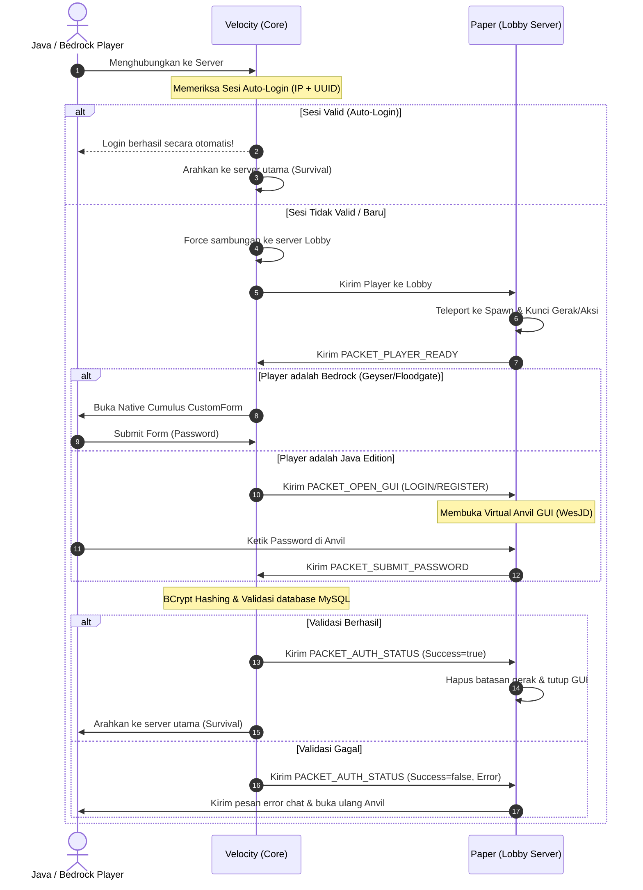

# NaturalAuth 🔐

[](https://github.com/Natural-Minecraft/NaturalCore/actions)


**NaturalAuth** adalah sistem autentikasi cross-platform modern dan aman yang dirancang khusus untuk server Minecraft bertema **Natural School SMP**. Plugin ini menggunakan arsitektur terpisah (split architecture) untuk menghubungkan proxy **Velocity** dan server backend **Paper (Lobby)**.

---

## 🏗️ Desain Arsitektur (Velocity + Paper)

Plugin ini **memerlukan kedua modul** untuk dapat berjalan secara fungsional:



### Mengapa Desain ini Digunakan?
*   **Keamanan Terpusat di Velocity**: Semua query database, hashing password dengan algoritma **BCrypt**, dan manajemen sesi *remember-me* diproses di level proxy. Ini mencegah player yang tidak terautentikasi mengirim paket nakal ke server backend lainnya.
*   **Dual-Platform GUI**: 
    *   **Bedrock (Geyser)**: Menggunakan form native Minecraft Bedrock (`Cumulus API`) sehingga tampilan login/register berupa dialog isian teks resmi yang rapi.
    *   **Java Edition**: Menggunakan virtual `Anvil GUI` (melalui library WesJD AnvilGUI) agar input teks aman dan elegan tanpa merusak chat history.

---

## ✨ Fitur Utama

- [x] **Gatekeeping Proxy**: Memblokir chat, perintah (commands), dan perpindahan server sebelum login sukses.
- [x] **Auto-Login (Remember-Me)**: Menyimpan sesi token aktif berdasarkan kombinasi IP + UUID selama rentang waktu yang bisa diatur (default: 24 jam).
- [x] **Dual GUI (Anvil & Bedrock Forms)**: Dukungan tampilan isian text field untuk Java & Bedrock.
- [x] **Lobby Schematic Auto-Load**: Companion Paper memuat struktur lobby (`lobby.nbt`) otomatis saat startup menggunakan API StructureManager bawaan Minecraft.
- [x] **Sistem Fallback Kuat**: Jika file schematic (`lobby.nbt`) hilang, plugin akan otomatis membangun platform bedrock 9x9 agar player tidak jatuh ke void.
- [x] **Anti-Bypass Aksi**: Mengunci total pergerakan player, merusak/menaruh blok, interaksi inventory, item drop/pickup, dan pembatalan damage selama di server Lobby sebelum terotentikasi.

---

## 📂 Struktur Modul Project

Project didefinisikan sebagai multi-module Maven:
1.  **`naturalauth-parent`** (`/pom.xml`): Parent POM yang mengorkestrasi dependencies dan proses kompilasi.
2.  **`naturalauth-common`**: Berisi definisi paket data dan protokol jembatan pesan plugin (`naturalauth:bridge`).
3.  **`naturalauth-velocity`**: Core plugin yang berjalan di Velocity Proxy.
4.  **`naturalauth-paper`**: Companion plugin yang berjalan di server Paper Lobby.

---

## 🚀 Instalasi & Konfigurasi

### 1. Sisi Proxy (Velocity)
1. Salin `.jar` dari build `naturalauth-velocity` ke folder `plugins` proxy Anda.
2. Restart proxy untuk menghasilkan file `plugins/naturalauth/config.toml`.
3. Atur konfigurasi database MySQL/MariaDB Anda:
   ```toml
   [database]
   host = "localhost"
   port = 3306
   name = "nsmp_naturalauth"
   username = "root"
   password = "password_kamu"
   table-prefix = "naturalauth_"

   [servers]
   lobby = "lobby"            # Nama server lobby/auth di velocity.toml
   success-target = "survival" # Nama server tujuan setelah login sukses
   ```

### 2. Sisi Lobby Server (Paper)
1. Salin `.jar` dari build `naturalauth-paper` ke folder `plugins` server lobby Anda.
2. Restart server untuk menghasilkan file `plugins/NaturalAuthPaper/config.yml`.
3. (Opsional) Salin file lobby structure Anda dan ganti namanya menjadi `lobby.nbt`, taruh di dalam folder `plugins/NaturalAuthPaper/`.
4. Sesuaikan koordinat spawn dan posisi penempatan lobby:
   ```yaml
   enable-schematic-loading: true

   schematic-paste:
     world: "world"
     x: 0
     y: 100
     z: 0

   spawn-location:
     world: "world"
     x: 0.5
     y: 102.0
     z: 0.5
     yaw: 0.0
     pitch: 0.0
   ```

---

## 🛠️ Cara Build (Kompilasi)

### Manual
Jalankan perintah berikut di root folder project:
```bash
mvn clean package
```
Hasil build `.jar` akan tersedia di folder:
*   Velocity: `naturalauth-velocity/target/naturalauth-velocity-1.0-SNAPSHOT.jar`
*   Paper: `naturalauth-paper/target/naturalauth-paper-1.0-SNAPSHOT.jar`

### Otomatis (CI/CD Github Actions)
Kompilasi sudah diotomatisasi melalui GitHub Actions yang terkonfigurasi pada [`.github/workflows/build.yml`](.github/workflows/build.yml). Setiap kali Anda melakukan `git push` ke branch `main` atau `master`:
1. GitHub runner akan memeriksa dependensi Java 21 dan Maven.
2. Project akan dikompilasi secara otomatis.
3. Hasil build `.jar` untuk Velocity dan Paper akan diunggah sebagai **Workflow Artifacts** yang dapat Anda unduh langsung secara instan dari halaman Github Actions!
